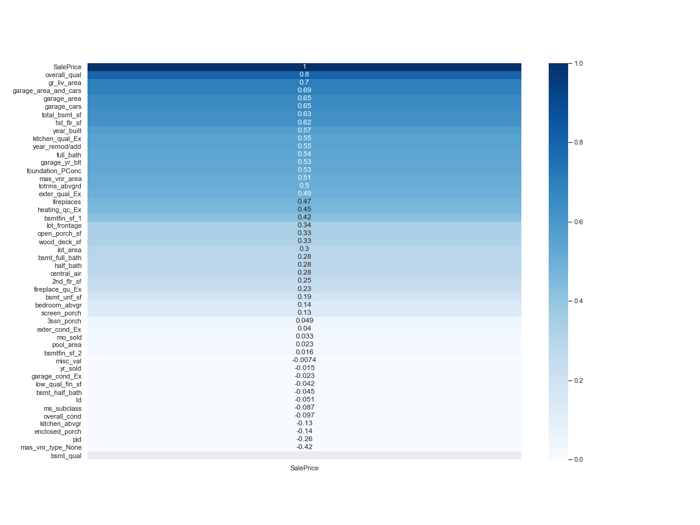
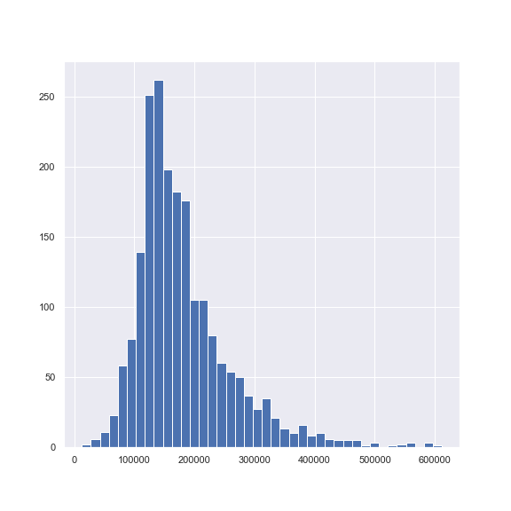
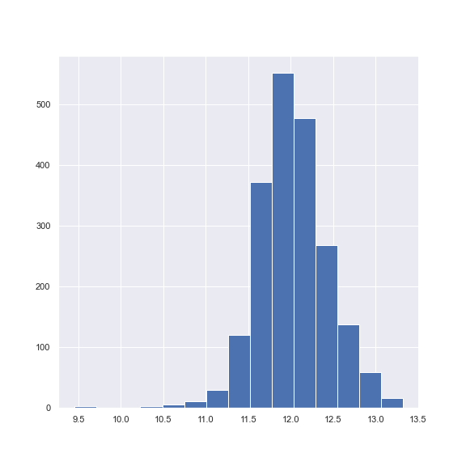

# Project 2- Ames Housing Data

With this project, we are looking to evaluate housing data in Ames, Iowa. In doing so we will perform regression modeling, regularization and other machine learning tasks

## Problem Statement

Two business partners who are expanding into real estate are looking to develop a long-term partnership with your analytics consulting firm, and you are tasked to develop a prediction model that will highlight the need for deeper analytics as they develop their strategy and enter the market. We hope to draw them into greater partnership with the firm.

The model will ideally predict and immediately provide the price of a house at sale. For the purposes of developing the model, a standard pricing dataset will be given. the model should be able to account for a variety of factors. 

## Background

In the U.S. housing market, predictive modeling is typically uses as a means to provide realtors an up-to-date comparison and price point for a home they are targeting in a buying/selling opportunity.

Historically, pricing and rent values of homes have primarily been based on total surface area and features, while location also plays a significant role on market values. Official home appraisals are done within the home on these values, as well as some prospects in the local market. 

For realtors and licensed professionals, a more complex form of analysis is used. Comparative Market Analysis ist often used as a means to evaluate a great deal of features. These are more complex forms of pricing evaluation, as it takes the broader market into consideration, and uses a defined set of metrics within the real-estate industry to evaluate housing markets. Namely:

* **"Rule of Three"**- Housing data that is current (within 6 months, ideally 3) is appropriate for analysis, while anything outside of that is excluded. Pending housing opportunities that have not yet closed may be used as well.
* **Market environment and location**
* **Surface area and lot size**
* **Overall condition and misc. features** - Any and all features are potential indicators of a house's value, and feature importance may shift due to culture or geography.
* **Financing terms**

These metrics encompass most of the pricing variables that matter within traditional modeling, and will be what we look to factor in within our modeling.

### Background Sources
Comparative market analysis: A guide. Rocket Mortgage. (n.d.). https://www.rocketmortgage.com/learn/comparative-market-analysis. 

Daniel Barr, C. F. A. (2018, June 28). Real estate valuation using regression analysis – a tutorial. Toptal Finance Blog. https://www.toptal.com/finance/real-estate/real-estate-valuation. 

### Data Background

The Data set contains information from the Ames Assessor's office on individual residential properities sold in Ames, IA from 2006 to 2010.

### Datasets Used

* [`train.csv`](./datasets/test.csv): Ames Housing Data, training set we will use as a predictor;([source](https://www.kaggle.com/c/dsir-82-project-2-regression-challenge/data))

* [`test.csv`](./datasets/test.csv): testing data we will make our prediction on;([source](https://www.kaggle.com/c/dsir-82-project-2-regression-challenge/data))

### Feature Selection

After cleaning, we drew in a heatmap (seen below) that showed the correlation of various features with our predictive variable. The data dictionary below shows the features we chose.

<H3>
Data Dictionary
</H3>

<H5>
Dataset has been condensed to show most utilized features within the model, Full data dictionary is sourced below:
</H5>

Original Source Data - ([source](http://jse.amstat.org/v19n3/decock/DataDocumentation.txt))

|Feature|Type|Dataset|Description|
|---|---|---|---|
|**Id**|*integer*|`train.csv`, `test.csv`|ID| 
|**lot_area**|*integer*|`train.csv`, `test.csv`|Lot size in square feet| 
|**overall_qual**|*integer*|`train.csv`, `test.csv`|Rates the overall material and finish of the house| 
|**1st_flr_sf**|*integer*|`train.csv`, `test.csv`|First Floor square feet|
|**2nd_flr_sf**|*integer*|`train.csv`, `test.csv`|Second floor square feet| 
|**gr_liv_area**|*integer*|`train.csv`, `test.csv`|Above grade (ground) living area square feet|
|**year_built**|*integer*|`train.csv`, `test.csv`|Original construction date| 
|**year_remod/add**|*integer*|`train.csv`, `test.csv`|Remodel date (same as construction date if no remodeling or additions)|
|**full_bath**|*integer*|`train.csv`, `test.csv`|Basement full bathrooms|
|**fireplaces**|*integer*|`train.csv`, `test.csv`|Number of fireplaces|
|**total_bsmt_sf**|*Float*|`train.csv`, `test.csv`|Total basement surface area|

<H3>
Engineered Features
</H3>

|Feature|Type|Dataset|Description|
|---|---|---|---|
|**bedroom_abvgr**|*integer*|`train.csv`, `test.csv`|Bedrooms above ground| 
|**heating_qc_Ex**|*integer*|`train.csv`, `test.csv`|If heating quality is excellent| 
|**external_qual_Ex**|*integer*|`train.csv`, `test.csv`|If exterior quality is excellent| 
|**kitchen_qual_Ex**|*integer*|`train.csv`, `test.csv`|If kitchen quality is excellent|
|**garage_area_and_cars**|*integer*|`train.csv`, `test.csv`|Size of garage in square feet * Size of garage in car capacity| 
|**foundation_PConc**|*integer*|`train.csv`, `test.csv`|Foundation of poured concrete|
|**mas_vnr_type_None**|*integer*|`train.csv`, `test.csv`|Houses without masonry| 

 
## Model Work

We ran 3 different models that were compared to a null model (mean sale price). Within our work, we selected over 17 features, and ran a standard linear regression on those features. Following this, we introduced a log transformation that improved skew we saw in our y variable, and ran Lasso and Ridge regressions that regularized our data in tandem with the log transformation.

#Original Sale Price

#Sale Price in normal distribution due to log

## Conclusions

To conclude our analysis: 

We were able to predict and the price of a house at sale, but further analysis is need to provided an immediate price point for the house. We were able to pick up accurate RMSE values, but need to do further transformation to be able to show a dollar per unit comparison out of our coefficients. Regardless, our modeling showed the impact of analytical modeling on the ability to predict housing prices, a critical strategy for you as you enter the market.

Our model ran on over 17 different features, and performed well above our null model, with an RMSE improvement of well over 50,000.

We ran three models, a standard linear regression, and with a log transformation, lasso and ridge regressions. Our SLR regression saw an 88% r-squared score, which meant 88% of our variance was explained by our inputs. Our r-squared score therelightly overfit, so we ran and ended up choosing our Lasso regression, which regularized well and accounted for the skew in our y variable.

With the model we chose, our r-squared scoring was 90.6%, with a better fit between our test and variance data. Our RMSE for that data was 24,400, 3k above our SLR regression.

In terms of other key findings within the data, we identified the following:

- Surface area is a strong predictor or price in Ames, Iowa, and will be a strong predictor in other markets.

- Kitchens and exteriors that are in excellent condition have a strong correlaton with sale price in Ames, Iowa, indicitive of consumer preferences for both as opposed to other features.

## Recommendations:

Having seen this modeling exercise we would encourage you to consider the following steps as you look to launch into the market.

As you enter the market:

- Prioritize surface area in your strategy- The data we modeled was very clear, surface area is probably the best predictor of pricing within the dataset, and out in the marketplace. It should be a significant feature in any modeling or analysis moving forward.

- Periodically review feature importance in pricing to find price multipliers-  Given some features are higher than others, and the market shifts constantly, there will always be price opportunities for those who see a trend and take advantage of it before the rest of the market. Specifically within our data, kitchen and exterior condition have a higher correlation with sales price than the # of baths or fireplaces in a home, so it can be inferenced that they are a higher priority. As well, exterior and kitchen features can vary a great deal, so customers may have changing tastes over time and need to be periodically evaluated.

How we can partner with you:

- Develop a specific model for your investment environment- The Ames data we showcased is just small sliver of what we do as a firm. As you look to enter into cities or investment opportunities around the country, feel free to reach out and utilize our domain experience and expertise. Specifically, we propose that we partner with you in your next venture, drawing in all available data and developing a model that is reproducible to other regions and one that fulfills a need for you in the short term.

- Develop a dashboard that can evaluate feature importance and changes over a rolling three-month period- This dashboard incorporates the model and fulfills the "Rule of three", a data benchmark that evaluates the market on the most current data. The dashboard would include a transformed coefficent list of various features, which would show the increase per unit at any given time. As well, there would be year-over-year and quarter-over-quarter values kept, which would show the change over time.

- Develop a real-time front-end solution (via js.react) that allows for you to specify metrics and get a predicted price out off of current data. This solution would run the modeling on the back-end, and would possibly incorporate the dashboard described above. Templates could be user-created to allow for quick access to a suite of features to choose from.